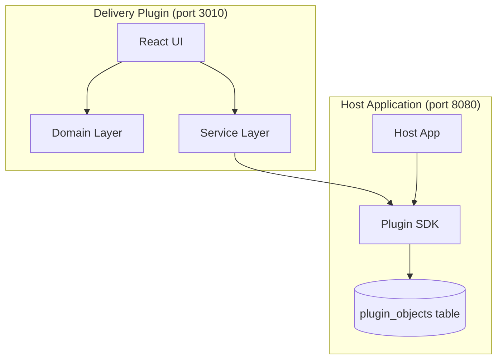
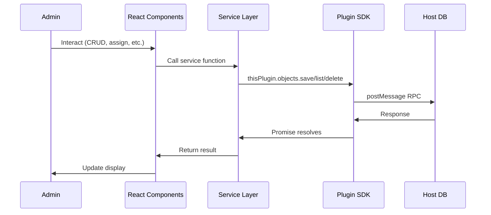
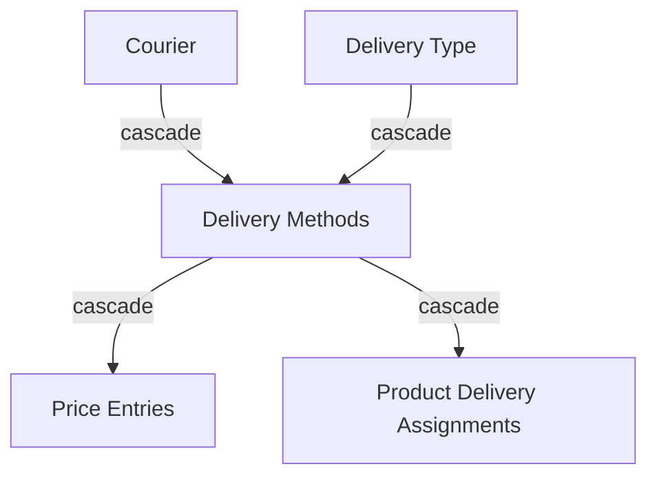

# Design Document: Delivery Plugin

## Overview

The Delivery Plugin is a standalone Vite/React frontend plugin for the microkernel e-commerce platform that enables administrators to manage delivery options for products. It follows the established plugin architecture pattern — running on port 3010, communicating with the host application via the Plugin SDK's `thisPlugin.objects` API for persistence.

The plugin manages a hierarchy of entities: **Couriers** (shipping carriers) → **Delivery Methods** (courier + delivery type combinations with pricing) → **Product Delivery Assignments** (which methods are available per product). It provides full CRUD for couriers and delivery types, composition of delivery methods, per-size-category pricing, and per-product delivery method assignment with cascade deletion to maintain data integrity.

### Key Design Decisions

1. **All data stored via Plugin SDK `thisPlugin.objects`** — no backend changes needed. The plugin uses the host's `plugin_objects` table with typed `objectType` values.
2. **Client-side cascade logic** — since the SDK provides individual object CRUD, cascade deletions are orchestrated in the frontend with application-level rollback on failure.
3. **Composite object IDs** — natural keys (e.g., `{courierId}-{deliveryTypeId}` for delivery methods) ensure uniqueness at the storage level.
4. **Validation in domain layer** — all validation logic lives in pure functions in `domain.ts`, separate from UI components, enabling property-based testing.

## Architecture

The plugin follows the established plugin architecture pattern used by the warehouse and box-size plugins:



### Extension Points

The plugin registers three extension points with the host:

| Extension Point | Type | Path | Purpose |
|---|---|---|---|
| Sidebar menu | `menu.main` | `/` | Main delivery management page |
| Product detail tab | `product.detail.tabs` | `/product-delivery` | Per-product delivery assignment |
| Product detail info | `product.detail.info` | `/product-delivery-badge` | Delivery count badge |

### Data Flow



## Components and Interfaces

### File Structure

```
plugins/delivery/
├── index.html              # SDK + plugin-ui.css in <head>
├── manifest.json           # Plugin identity + extension points
├── package.json
├── vite.config.ts          # Port 3010
├── tsconfig.json
└── src/
    ├── main.tsx            # Router with 3 routes
    ├── domain.ts           # Domain types, mappers, validators
    ├── services.ts         # SDK interaction layer (CRUD, cascades)
    └── pages/
        ├── DeliveryPage.tsx         # Main page: couriers, types, methods, pricing
        ├── ProductDeliveryTab.tsx   # Product detail tab: assignment toggles
        └── ProductDeliveryBadge.tsx # Product detail info: count badge
```

### Component Responsibilities

#### `DeliveryPage.tsx` — Main Management Page

The primary admin interface, organized into sections:

1. **Couriers Section** — CRUD table with name + tracking URL template
2. **Delivery Types Section** — CRUD table with name
3. **Delivery Methods Section** — Composition table (courier × delivery type) with pricing sub-panel
4. **Pricing Panel** — Inline price inputs per size category for a selected delivery method

#### `ProductDeliveryTab.tsx` — Product Delivery Assignment

Renders within the product detail view. Shows all delivery methods with toggle switches. Includes "Enable All" bulk action. Reads `productId` from SDK context.

#### `ProductDeliveryBadge.tsx` — Delivery Info Badge

Compact badge (~60px height) showing delivery method count for the current product. Uses `tc-badge--success` or `tc-badge--danger` styling based on count.

### Service Layer (`services.ts`)

Encapsulates all SDK interactions and cascade logic:

```typescript
// Core CRUD
createCourier(name: string, trackingUrlTemplate: string): Promise<Courier>
updateCourier(id: string, name: string, trackingUrlTemplate: string): Promise<Courier>
deleteCourier(id: string): Promise<void>  // with cascade
listCouriers(): Promise<Courier[]>

createDeliveryType(name: string): Promise<DeliveryType>
updateDeliveryType(id: string, name: string): Promise<DeliveryType>
deleteDeliveryType(id: string): Promise<void>  // with cascade
listDeliveryTypes(): Promise<DeliveryType[]>

createDeliveryMethod(courierId: string, deliveryTypeId: string): Promise<DeliveryMethod>
deleteDeliveryMethod(id: string): Promise<void>  // with cascade
listDeliveryMethods(): Promise<DeliveryMethod[]>

// Pricing
savePrice(deliveryMethodId: string, sizeCategory: SizeCategory, amount: number): Promise<PriceEntry>
listPrices(deliveryMethodId: string): Promise<PriceEntry[]>

// Assignments
enableDeliveryMethod(productId: string, deliveryMethodId: string): Promise<void>
disableDeliveryMethod(productId: string, deliveryMethodId: string): Promise<void>
enableAllDeliveryMethods(productId: string): Promise<void>
listAssignments(productId: string): Promise<ProductDeliveryAssignment[]>
countAssignments(productId: string): Promise<number>

// Cascade helpers
getCascadeImpact(entityType: 'courier' | 'deliveryType', entityId: string): Promise<CascadeImpact>
```

### Domain Layer (`domain.ts`)

Pure functions and types — no SDK dependency:

```typescript
// Types
interface Courier { objectId: string; name: string; trackingUrlTemplate: string; }
interface DeliveryType { objectId: string; name: string; }
interface DeliveryMethod { objectId: string; courierId: string; deliveryTypeId: string; courierName: string; deliveryTypeName: string; }
interface PriceEntry { objectId: string; deliveryMethodId: string; sizeCategory: SizeCategory; amount: number; currency: string; }
interface ProductDeliveryAssignment { objectId: string; productId: string; deliveryMethodId: string; }
type SizeCategory = 'S' | 'M' | 'L' | 'XL';
interface CascadeImpact { deliveryMethodCount: number; assignmentCount: number; priceEntryCount: number; }

// Validators (pure functions)
validateCourierName(name: string): ValidationResult
validateTrackingUrlTemplate(template: string): ValidationResult
validateDeliveryTypeName(name: string): ValidationResult
validatePrice(amount: number): ValidationResult
isNameDuplicate(name: string, existingNames: string[], excludeId?: string): boolean

// Mappers
toCourier(obj: PluginObject): Courier
toDeliveryType(obj: PluginObject): DeliveryType
toDeliveryMethod(obj: PluginObject): DeliveryMethod
toPriceEntry(obj: PluginObject): PriceEntry
toAssignment(obj: PluginObject): ProductDeliveryAssignment

// Sorting
sortDeliveryMethods(methods: DeliveryMethod[]): DeliveryMethod[]
```

## Data Models

### Object Types and Storage

All data is stored via `thisPlugin.objects` with the following object types:

| Object Type | Object ID Pattern | Data Shape | Entity Binding |
|---|---|---|---|
| `courier` | UUID | `{ name, trackingUrlTemplate }` | None |
| `delivery-type` | UUID | `{ name }` | None |
| `delivery-method` | `{courierId}-{deliveryTypeId}` | `{ courierId, deliveryTypeId, courierName, deliveryTypeName }` | None |
| `price-entry` | `{deliveryMethodId}-{sizeCategory}` | `{ deliveryMethodId, sizeCategory, amount, currency }` | None |
| `assignment` | `{productId}-{deliveryMethodId}` | `{ productId, deliveryMethodId }` | `PRODUCT` / `{productId}` |

### Object ID Design Rationale

- **Couriers and Delivery Types** use UUIDs because they have no natural composite key.
- **Delivery Methods** use `{courierId}-{deliveryTypeId}` to enforce uniqueness of the combination at the storage level.
- **Price Entries** use `{deliveryMethodId}-{sizeCategory}` to enforce one price per size category per method (upsert semantics).
- **Assignments** use `{productId}-{deliveryMethodId}` to enforce one assignment per product-method pair.

### Entity Binding

Only `assignment` objects are bound to `PRODUCT` entities. This enables efficient querying via `thisPlugin.objects.list("assignment", { entityType: "PRODUCT", entityId: productId })` for the product detail tab and badge.

### Cascade Deletion Chain



Deleting a Courier or Delivery Type triggers:
1. Find all Delivery Methods referencing the deleted entity
2. For each Delivery Method: delete all Price Entries and Assignments
3. Delete the Delivery Methods themselves
4. Delete the Courier/Delivery Type

### Validation Rules

| Field | Rules |
|---|---|
| Courier name | Non-empty, ≥1 non-whitespace char, ≤100 chars, unique (case-insensitive) |
| Tracking URL template | Non-empty, ≤500 chars, must contain `{trackingNumber}` |
| Delivery type name | Non-empty, ≥1 non-whitespace char, ≤100 chars, unique (case-insensitive) |
| Price amount | ≥0.00, ≤999,999.99, max 2 decimal places |
| Delivery method | Both courier and delivery type required, combination unique |

## Correctness Properties

*A property is a characteristic or behavior that should hold true across all valid executions of a system — essentially, a formal statement about what the system should do. Properties serve as the bridge between human-readable specifications and machine-verifiable correctness guarantees.*

### Property 1: Courier CRUD Round-Trip

*For any* valid courier name (non-empty, ≤100 chars, contains non-whitespace) and valid tracking URL template (contains `{trackingNumber}`, ≤500 chars), creating a courier and then listing all couriers should include a courier with that exact name and template.

**Validates: Requirements 1.3, 1.6**

### Property 2: Delivery Type CRUD Round-Trip

*For any* valid delivery type name (non-empty, ≤100 chars, contains non-whitespace), creating a delivery type and then listing all delivery types should include a delivery type with that exact name.

**Validates: Requirements 2.2, 2.6**

### Property 3: Case-Insensitive Name Uniqueness

*For any* existing entity name (courier or delivery type) and any case-variant of that name (e.g., uppercase, lowercase, mixed), attempting to create or update another entity with the case-variant name should be rejected by validation.

**Validates: Requirements 1.4, 2.3, 2.5**

### Property 4: Name Validation Rejects Invalid Input

*For any* string that is empty, composed entirely of whitespace characters, or exceeds 100 characters in length, the name validation function should reject it and return an appropriate error reason.

**Validates: Requirements 1.7, 2.7, 2.8**

### Property 5: Tracking URL Template Placeholder Validation

*For any* string that does not contain the exact substring `{trackingNumber}`, the tracking URL template validation function should reject it.

**Validates: Requirements 1.8**

### Property 6: Delivery Method Composition Round-Trip

*For any* valid courier ID and valid delivery type ID that both exist in the system, creating a delivery method and then listing all delivery methods should include a method linking that courier and delivery type.

**Validates: Requirements 3.1**

### Property 7: Delivery Method Duplicate Combination Rejection

*For any* courier and delivery type pair, after successfully creating a delivery method for that pair, attempting to create another delivery method with the same pair should be rejected.

**Validates: Requirements 3.2**

### Property 8: Delivery Methods Sort Order

*For any* set of delivery methods, the list returned by `listDeliveryMethods()` should be sorted alphabetically by courier name first, then by delivery type name within the same courier.

**Validates: Requirements 3.4**

### Property 9: Price Entry Upsert Round-Trip

*For any* delivery method, size category, and valid price amount (0.00 to 999,999.99, ≤2 decimal places), saving a price and then retrieving prices for that delivery method should include an entry with that exact amount, size category, and EUR currency. Saving again with a different valid amount should overwrite the previous value.

**Validates: Requirements 4.3, 4.7**

### Property 10: Price Validation Rejects Invalid Values

*For any* number that is negative, has more than 2 decimal places, or exceeds 999,999.99, the price validation function should reject it.

**Validates: Requirements 4.5**

### Property 11: Assignment Toggle Round-Trip

*For any* product and delivery method, enabling the assignment and then listing assignments for that product should include that delivery method. Subsequently disabling it and listing again should not include it.

**Validates: Requirements 5.2, 5.3**

### Property 12: Enable All Idempotence

*For any* product and set of delivery methods (where some may already be assigned), executing "Enable All" should result in all delivery methods being assigned to that product. Executing "Enable All" again should produce the same state (idempotent).

**Validates: Requirements 5.4**

### Property 13: Cascade Deletion Integrity

*For any* courier (or delivery type) that has associated delivery methods, and those delivery methods have associated price entries and product assignments, deleting the courier (or delivery type) should result in: (a) no delivery methods referencing that entity, (b) no price entries referencing those delivery methods, and (c) no product assignments referencing those delivery methods.

**Validates: Requirements 5.7, 5.8, 8.1, 8.2, 8.3, 8.4**

### Property 14: Cascade Confirmation Count Accuracy

*For any* courier (or delivery type) with N associated delivery methods, M total product assignments across those methods, and P total price entries across those methods, the cascade impact calculation should return exactly {deliveryMethodCount: N, assignmentCount: M, priceEntryCount: P}.

**Validates: Requirements 8.5**

### Property 15: Cancel Abort Preserves State

*For any* system state (set of couriers, delivery types, delivery methods, price entries, and assignments), initiating a cascade deletion and then canceling should leave all records unchanged — the state after cancel should be identical to the state before.

**Validates: Requirements 8.6**

### Property 16: Badge Count Accuracy

*For any* product with N product delivery assignments, the badge count function should return exactly N.

**Validates: Requirements 6.1**

## Error Handling

### SDK Call Failures

All SDK calls (`thisPlugin.objects.*`) are wrapped in try/catch blocks. On failure:
- Display a user-visible error message using the `tc-error` CSS class
- Preserve any user-entered form data (do not clear inputs on error)
- Log the error to console for debugging

### Cascade Deletion Failure and Rollback

Since the Plugin SDK provides individual object operations (no transactions), cascade deletions implement application-level rollback:

1. **Before cascade**: Snapshot all objects that will be affected (assignments, price entries, delivery methods)
2. **Execute cascade**: Delete in order — assignments first, then price entries, then delivery methods, then the parent entity
3. **On failure**: Re-create all previously deleted objects from the snapshot using `thisPlugin.objects.save`
4. **Report**: Show error message indicating the deletion could not be completed

```typescript
async function cascadeDelete(entityType: 'courier' | 'deliveryType', entityId: string): Promise<void> {
  const snapshot = await collectCascadeSnapshot(entityType, entityId);
  const deleted: PluginObject[] = [];

  try {
    // Delete in dependency order
    for (const obj of snapshot.assignments) {
      await sdk.thisPlugin.objects.delete(obj.objectType, obj.objectId);
      deleted.push(obj);
    }
    for (const obj of snapshot.priceEntries) {
      await sdk.thisPlugin.objects.delete(obj.objectType, obj.objectId);
      deleted.push(obj);
    }
    for (const obj of snapshot.deliveryMethods) {
      await sdk.thisPlugin.objects.delete(obj.objectType, obj.objectId);
      deleted.push(obj);
    }
    await sdk.thisPlugin.objects.delete(entityType === 'courier' ? 'courier' : 'delivery-type', entityId);
  } catch (error) {
    // Rollback: re-create deleted objects
    for (const obj of deleted.reverse()) {
      await sdk.thisPlugin.objects.save(obj.objectType, obj.objectId, obj.data,
        obj.entityType ? { entityType: obj.entityType, entityId: obj.entityId } : undefined);
    }
    throw new Error('Cascade deletion failed. All changes have been rolled back.');
  }
}
```

### Validation Errors

Validation errors are displayed inline next to the relevant form field using the `tc-error` class. The `ValidationResult` type carries both a success/failure flag and an error message:

```typescript
interface ValidationResult {
  valid: boolean;
  error?: string;
}
```

### Network/Timeout Errors

The SDK has a 10-second timeout. If a call times out:
- Show a generic "Operation could not be completed" error
- Preserve form state
- Allow the user to retry

## Testing Strategy

### Property-Based Testing

The domain layer (`domain.ts`) contains pure validation and transformation functions that are ideal for property-based testing. We will use **fast-check** as the property-based testing library (standard choice for TypeScript/React projects).

**Configuration:**
- Minimum 100 iterations per property test
- Each test tagged with: `Feature: delivery-plugin, Property {number}: {property_text}`

**What to test with PBT:**
- All validation functions (name validation, price validation, URL template validation)
- Uniqueness checking logic
- Sort order function
- Cascade impact calculation
- Badge count calculation
- Round-trip properties (create → list → find)

### Unit Testing (Example-Based)

Using **Vitest** (standard for Vite projects) with React Testing Library for component tests:

- Empty state rendering (no couriers, no delivery types, no methods)
- Confirmation dialog display and cancel behavior
- Error message display on SDK failure
- Form data preservation on error
- Badge style (success vs danger) based on count
- Specific validation edge cases (exactly 100 chars, exactly 0.00 price)

### Integration Testing

- Full CRUD flow for each entity type (create, read, update, delete)
- Cascade deletion end-to-end (courier → methods → assignments + prices)
- Product delivery assignment toggle flow
- "Enable All" with mixed existing/new assignments

### Test File Structure

```
plugins/delivery/
└── src/
    └── __tests__/
        ├── domain.test.ts          # Unit tests for domain functions
        ├── domain.property.test.ts # Property-based tests for validators and logic
        ├── services.test.ts        # Service layer tests (mocked SDK)
        ├── DeliveryPage.test.tsx   # Component tests
        ├── ProductDeliveryTab.test.tsx
        └── ProductDeliveryBadge.test.tsx
```
